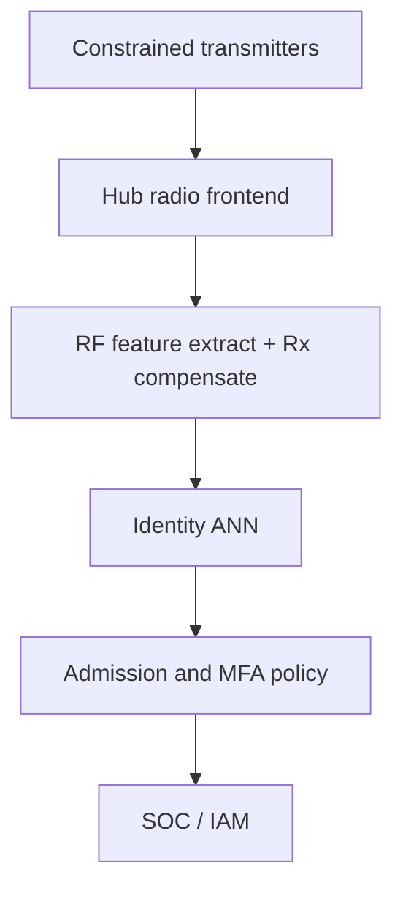

# AetherGrain

**Source:** `ai-in-iot/1805.01374/`
**Domain:** `ai-iot`
**One-liner:** A hub-side RF physical-unclonable authenticator that recognizes transmitters from manufacturing “grain” in their radio chains — without putting keys, PUFs, or preambles on the constrained IoT node.
**Wedge:** Asymmetric IoT networks (many low-cost sensors, one powered gateway) in smart buildings, body/biosensor hubs, and industrial star topologies where OAuth-per-device and NVM keys do not scale.
**Positioning:** Preamble-less RF-PUF at the receiver brain. Distinct from WhisperLock (acoustic biometric on-device) and PulseGate (ECG gate): AetherGrain productizes RF-PUF’s asymmetry — entropy lives in transmitter non-idealities (I/Q imbalance, frequency offset); the ANN at the hub does the heavy lifting, hitting ~99.9% accuracy at 4,800 transmitters and ~99% at 10,000 under varying channels in the source simulations.

## Market research synthesis

### Thesis from source

CISCO VNI-class forecasts put M2M near 27B devices; mobile IoT nodes operate in untrusted environments while hardware security lagged compute. Symmetric keys in NVM/SRAM invite invasive and side-channel extraction and burn area/power; OAuth 2.0 per device is cumbersome and CSRF-prone as device counts grow. Silicon PUFs help but often need extra circuitry and error correction that can leak syndrome material. RF fingerprinting exists but typically needs high oversampling, careful transient detection, or fixed preambles.

RF-PUF’s commercial insight is the voice analogy: identity is in the speaker’s grain, not the sentence. Process and board variations imprint on every transmission; a supervised ANN at the central hub classifies transmitters from those RF properties after compensating receiver non-idealities and training across data and channel variability — preamble-less and without extra Tx hardware. Simulation results claim 99.9% accuracy for ~4,800 transmitters and 99% for 10,000, aimed at small-to-medium smart systems (~1,000 devices per gateway). The method can stand alone at the physical layer or join multi-factor stacks. Applications listed include intrusion detection, forensics, defect monitoring, and body-connected biosensors.

### Buyer & economic model

- **Primary buyer:** Head of IoT Platform Security at gateway/hub OEMs and smart-building operators.
- **Users:** RF/firmware engineers, SOC (device impersonation alerts), identity admins, compliance.
- **Budget owner / value metric:** device-identity and breach budget. Value metrics: impersonation catch rate, enrollment time per device, false reject rate under channel change, keys-not-stored on endpoints.
- **Competing status quo:** per-device certificates/NVM keys; OAuth pairing UX; preamble-based RF fingerprint appliances; challenge-response silicon PUFs requiring Tx silicon changes.

### Domain constraints

- **Regulatory / trust / safety:** physical-layer auth is not a full CIA stack — must compose with higher layers; spoofing via specialized Tx clones is a residual risk to disclose.
- **Data sensitivity:** RF feature templates are biometric-like device secrets at the hub; protect like credentials.
- **Change-management realities:** hubs need ML capacity; brownfield transmitters need no hardware change — the selling point — but enrollment traffic and template updates need ops process.

## Business requirements

- BR-1: Authentication must work without additional PUF circuitry or stored secret keys on the transmitter.
- BR-2: Classification must not require a fixed RACH/preamble — steady-state traffic under varied payloads must suffice after enrollment.
- BR-3: Hub models must compensate receiver non-idealities so templates travel with the transmitter identity, not the hub’s distortion.
- BR-4: Accuracy under enrolled channel conditions must meet contractual floors consistent with source-scale claims (≥99% class for thousand-device hubs).
- BR-5: Unknown or mismatched RF grain must fail closed into an impersonation/quarantine workflow.
- BR-6: Enrollment and re-enrollment must be operator-attested events with audit trails.
- BR-7: Templates must be exportable/importable under encryption for hub replacement without re-touching every sensor when policy allows.
- BR-8: Multi-factor mode must combine RF-PUF results with network/app identity rather than silently replacing them.
- BR-9: Channel-condition drift monitors must trigger re-enrollment recommendations before false rejects spike.
- BR-10: Hub resource profiles must declare max enrolled transmitters per model tier (e.g., 1k / 5k / 10k).
- BR-11: Forensic mode must retain signed auth decisions for incident windows without storing raw IQ by default.
- BR-12: Commercial packaging prices by hub tier and enrolled transmitters, matching asymmetric topology economics.

## User stories

Canonical user stories live in sibling [USER_STORIES.md](USER_STORIES.md).

## System design

### Overview

AetherGrain runs on the gateway: enroll transmitters by collecting RF feature vectors under supervised labels, train/update the ANN, compensate Rx signatures, and score live frames. Decisions feed allow/deny hooks into the local network admission path and optional multi-factor identity providers. Endpoints need no firmware beyond normal radio traffic.

### Actors & boundaries

- **Actors:** hub runtime, transmitters, security lead, RF engineer, SOC, identity admin.
- **Trust boundary:** templates and models live on the hub; endpoints never hold RF-PUF secrets.
- **Human-in-the-loop points:** enrollment attestation, revocation, multi-factor policy, hub migration.

### Core capabilities

1. **Transmitter enrollment**
2. **RF feature extraction and Rx compensation**
3. **ANN identity scoring**
4. **Admission / quarantine hooks**
5. **Template lifecycle (revoke, migrate)**
6. **Drift monitoring and re-enrollment**
7. **Multi-factor composition**
8. **Forensic decision export**

### Conceptual data

- **Primary entities:** Hub, Transmitter, EnrollmentSession, RfTemplate, AuthDecision, DriftAlert, FactorPolicy, ForensicPack.
- **Critical events:** enrolled, scored, mismatched, revoked, migrated, drift raised.
- **Retention / audit needs:** decisions and enrollment attestations retained for incident windows; IQ samples optional and off by default.

### Integrations (conceptual)

- **Systems of record:** device inventory, NAC/Wi-Fi controller, IAM.
- **Upstream signals:** baseband/IQ feature taps from hub radio.
- **Downstream actions:** admit/deny, SOC alerts, ticket creation.

### High-level architecture

### Success metrics

- **Leading:** enrollment completion time; drift alerts; template migration success; hub tier utilization.
- **Lagging:** false accept / false reject in field; impersonation incidents blocked; % endpoints with zero stored RF-PUF secrets; hub replacement MTTR.

## OpenAPI skeleton

Canonical HTTP surface lives in sibling [openapi.yaml](openapi.yaml). Summary:

- **Base path:** `/v1/...`
- **Auth:** `X-API-Key` for hub agents; Bearer JWT for operators.
- **Resource groups:** Hubs, Transmitters, Enrollments, Decisions, Templates, Forensics.
