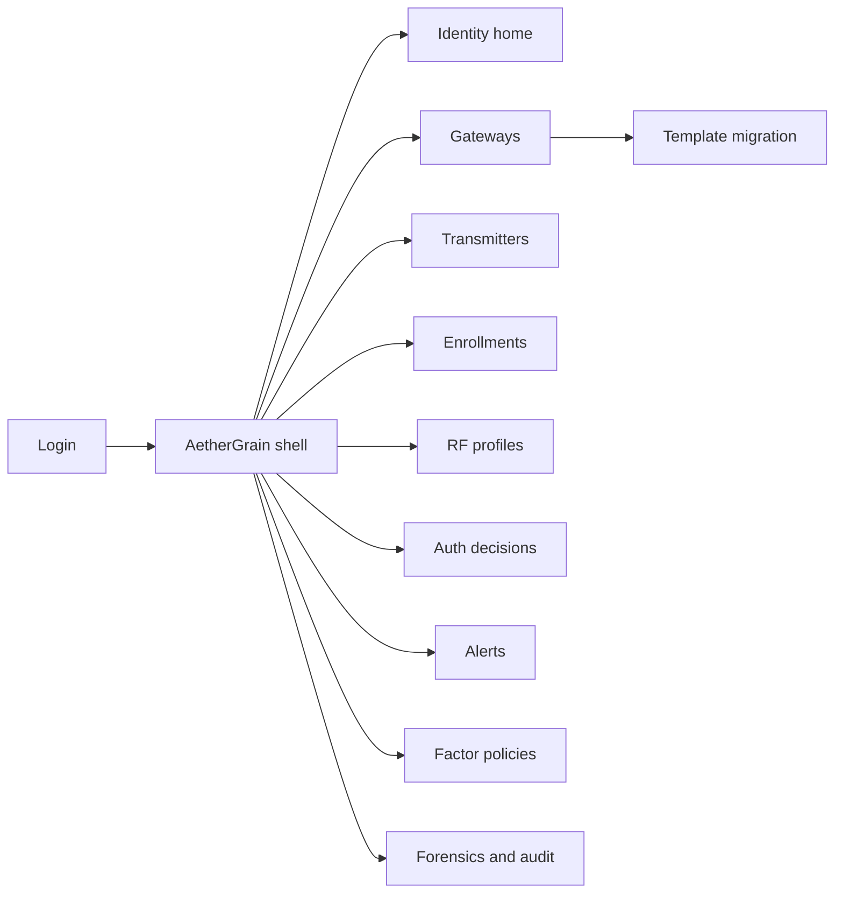
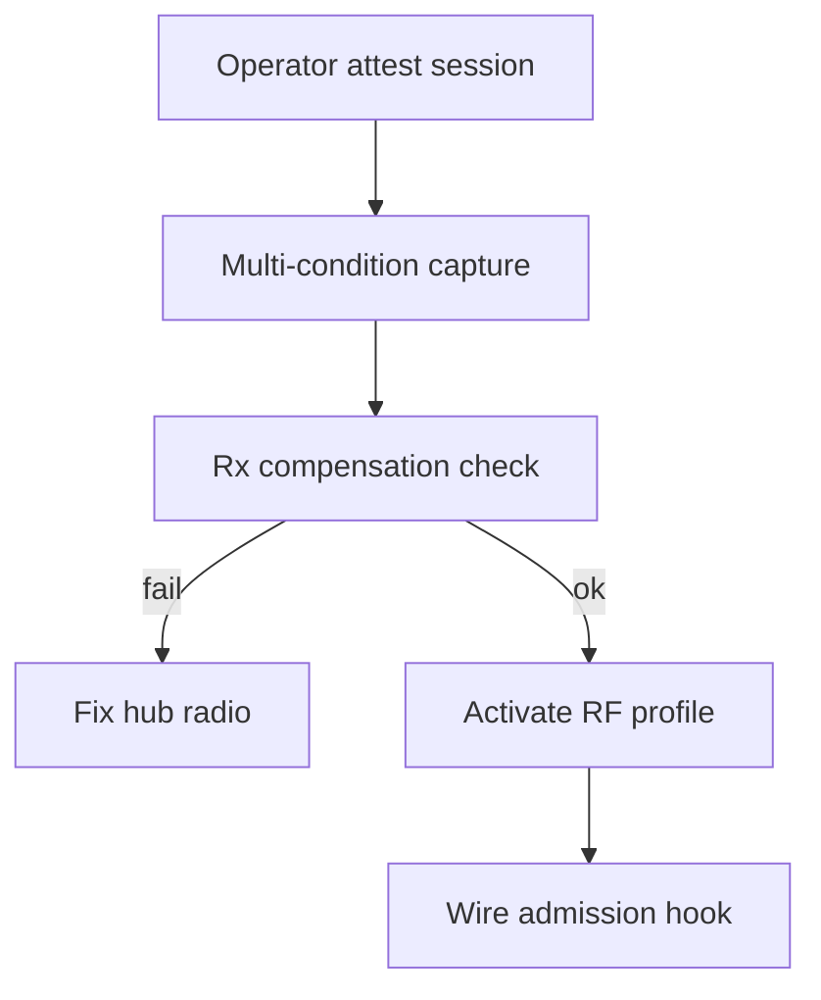
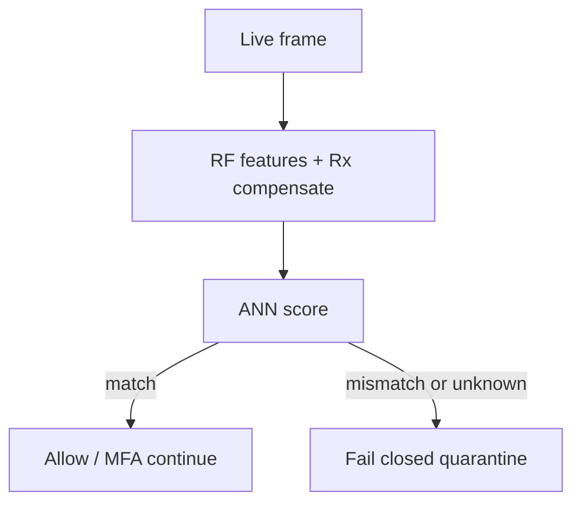

# AetherGrain — Web app

**Product:** [PRODUCT.md](./PRODUCT.md)
**Primary surface:** Hub RF-identity console (platform security + identity admin under one AetherGrain shell)
**Secondary surfaces:** Forensic auth-decision pack viewer (read-only); encrypted template migration wizard
**Design thesis:** AetherGrain is a voiceprint desk for radios — the UI metaphor is transmitter “grain” enrollment and hub-side judgment, not a certificate PKI tree. Visual language is deep ink with grain-gold identity match and coral unknown-grain quarantine: a match feels like recognizing a familiar speaker; a mismatch fails closed into isolation, never a soft warning tile. The wordmark sits as a quiet gold seal on every enrollment and forensic screen so operators know whose physical-layer identity they are trusting — while endpoints show zero stored RF secrets by design.

## UX research synthesis

### Category peers (best-in-class)

- **Cisco ISE / Aruba ClearPass:** Device onboarding, profiling, and fail-closed NAC admission with policy sets. Steal: admit/deny hooks and quarantine VLAN-style workflows; reject cert-enrollment wizards as the primary story — AetherGrain’s enrollment is RF grain capture without Tx keys.
- **CrowdStrike / SentinelOne device identity views:** Impersonation and unauthorized-device alerts with forensic timelines. Steal: decision-centric SOC queue with signed evidence packs; reject endpoint-agent chrome AetherGrain does not need on sensors.
- **Verayo / Intrinsic ID PUF tooling (vendor portals):** PUF enrollment lifecycle, template protection, and device binding. Steal: template as credential-class secret with retention limits; reject challenge-response silicon that requires Tx PUF circuitry (opposite of BR-1).
- **Ekahau / RF planning adjacent ops UIs:** Channel-condition awareness and site context for wireless accuracy. Steal: multi-condition enrollment and drift monitors (BR-9); reject heatmaps as the product home.

### Patterns to adopt / reject

- **Adopt:** Hub-first asymmetric topology; preamble-less enrollment across channel conditions; Rx compensation status; fail-closed unknown grain; RF as MFA factor beside certs; encrypted template migrate on hub swap; forensic decisions without raw IQ by default; hub tier caps (1k/5k/10k).
- **Reject:** Per-device NVM key provisioning UX as required path; editable auth scores; purple “AI biometric” glow; IQ waterfall as default storage; silent replacement of higher-layer identity; card grids of vanity accuracy without fail-closed state.

### Trust, density, and workflow constraints from PRODUCT.md

No extra PUF silicon or stored secrets on transmitters (BR-1); classification without fixed preamble (BR-2). Templates are biometric-like at the hub (domain) — protect, retain limits, audit enrollment (BR-6). Fail closed on mismatch (BR-5). Multi-factor composition explicit (BR-8). Hub tiers declare max transmitters (BR-10). Forensic packs of decisions, not IQ by default (BR-11). Spoofing via specialized clones is residual risk to disclose in UI copy where relevant.

## Information architecture

### Nav model

### Roles → default home

| Role | Default home | Why |
|------|--------------|-----|
| Platform security lead | Identity home — match vs quarantine | Impersonation posture (BR-5) |
| RF engineer | Enrollments + gateway Rx status | Multi-condition enroll (BR-3, BR-9) |
| SOC analyst | Alerts / auth decisions | Isolate star branch (BR-5, BR-11) |
| Identity administrator | Profiles + enrollment attestation | Revoke / migrate (BR-6, BR-7) |
| Compliance officer | Audit / “no endpoint secrets” evidence | Claim verification (BR-1) |

### Cross-links to OpenAPI resources

| Nav area | OpenAPI tags / resources |
|----------|---------------------------|
| Transmitter inventory | Devices |
| RF profile capture | Enrollments |
| Active RF signatures | Profiles |
| Allow / deny / unknown scoring | AuthDecisions |
| Unknown Tx and Rx faults | Alerts |
| Receiver hubs and migration | Gateways |
| Stand-alone vs multi-factor | Policies |
| Decision evidence | Audit |

## Screen inventory

### Identity home

- **Purpose:** Answer “are hub-side RF identities holding, and what is failing closed right now?” in one composition.
- **Entry:** Security lead default; deep link from impersonation alerts.
- **Layout regions:** Brand chrome; KPI strip (enrolled Tx, match rate, false-reject trend, unknowns quarantined, hub tier utilization); gateway health (Rx compensation ok); alerts rail.
- **Primary actions:** Open quarantine queue; start enrollment; open drift recommendations.
- **Empty / loading / error:** Empty = register gateway tier + first enrollment; error = retry with request id.
- **BR / story ties:** BR-4, BR-5, BR-10.

### Gateway hubs

- **Purpose:** Manage receiver brains: tier capacity, Rx compensation, migration targets.
- **Entry:** Gateways nav.
- **Layout regions:** Hub table (tier max Tx, enrolled count, Rx compensate status, model version); detail with radio frontend health; migration CTA.
- **Primary actions:** Register hub; certify Rx compensation; open migrate.
- **Empty / loading / error:** Over-tier enrollment blocked with upgrade path (BR-10).
- **BR / story ties:** BR-3, BR-10, BR-12.

### Transmitter inventory

- **Purpose:** Bind logical device ids to RF profiles without provisioning NVM RF-PUF secrets on the node.
- **Entry:** Devices nav.
- **Layout regions:** Device table (hub, profile state, last decision, MFA factors bound); “endpoint secrets: none for RF-PUF” trust cue; revoke control.
- **Primary actions:** Bind inventory id; revoke profile; open decisions.
- **Empty / loading / error:** Unbound radio traffic → unknown alert path.
- **BR / story ties:** BR-1; security lead no-NVM story.

### Enrollment studio

- **Purpose:** Operator-attested capture across channel conditions; preamble-less steady-state traffic after labels.
- **Entry:** Enrollments nav; home CTA.
- **Layout regions:** Session wizard (label device, channel conditions checklist, capture progress); Rx compensation gate; attestation sign-off; accuracy smoke test.
- **Primary actions:** Start session; attest complete; abort; schedule re-enroll.
- **Empty / loading / error:** Insufficient channel diversity = cannot complete (BR-9 adjacent); unattested session cannot activate profile (BR-6).
- **BR / story ties:** BR-2, BR-6; RF engineer stories.

### RF profiles

- **Purpose:** Lifecycle of active templates: activate, revoke, retention countdown.
- **Entry:** Profiles nav; after enrollment.
- **Layout regions:** Profile list (digest, hub, retention expiry, drift score); detail without raw IQ; revoke/migrate actions.
- **Primary actions:** Revoke; export encrypted for migration; set retention.
- **Empty / loading / error:** Expired retention = forced re-enroll path.
- **BR / story ties:** BR-7; compliance retention story.

### Auth decisions

- **Purpose:** Live allow / deny / unknown scoring feeding admission hooks.
- **Entry:** Decisions nav; SOC path.
- **Layout regions:** Stream (transmitter, hub, score band, factors used, action); detail with policy explanation; quarantine link.
- **Primary actions:** Force deny; release with MFA proof; open forensic append.
- **Empty / loading / error:** Unknown grain always coral fail-closed, never “low confidence allow.”
- **BR / story ties:** BR-5, BR-8.

### Impersonation and Rx-fault alerts

- **Purpose:** Queue unknowns, mismatches, and receiver faults that threaten template portability.
- **Entry:** Alerts nav; SOC default secondary.
- **Layout regions:** Alert queue; hub/device context; suggested isolate branch action; Rx fault vs Tx mismatch differentiation.
- **Primary actions:** Quarantine; ticket; mark Rx maintenance.
- **Empty / loading / error:** Healthy = last check time message.
- **BR / story ties:** BR-3, BR-5; SOC stories.

### Factor policies

- **Purpose:** Compose RF-PUF with network/app identity; never silently replace higher layers.
- **Entry:** Policies nav.
- **Layout regions:** Policy editor (stand-alone vs MFA required); scope by hub/site; residual risk disclosure callout for specialized Tx clones.
- **Primary actions:** Save policy; require MFA for high-risk zones.
- **Empty / loading / error:** Stand-alone mode shows amber diligence warning.
- **BR / story ties:** BR-8; security lead MFA story.

### Template migration

- **Purpose:** Encrypted export/import to replacement hub without re-touching every sensor when policy allows.
- **Entry:** Gateway detail → Migrate.
- **Layout regions:** Source/target hubs; encrypted pack status; verification checklist (Rx compensate on target); cutover.
- **Primary actions:** Export pack; import; verify sample scores; complete cutover.
- **Empty / loading / error:** Target Rx compensation fail blocks cutover.
- **BR / story ties:** BR-7; identity admin hub-replacement story.

### Forensics and audit

- **Purpose:** Signed auth decisions for incident windows; prove no endpoint RF-PUF secrets; optional IQ off by default.
- **Entry:** Audit nav; compliance.
- **Layout regions:** Decision pack builder; enrollment attestation log; “endpoint secret inventory: empty for RF-PUF” evidence panel; IQ retention toggle (default off).
- **Primary actions:** Generate forensic pack; export compliance evidence.
- **Empty / loading / error:** IQ enabled shows coral retention warning.
- **BR / story ties:** BR-1, BR-11; compliance stories.

## Key flows

1. **Enroll a transmitter** — attest session → multi-condition capture → Rx compensate check → activate profile → admission hook; failure: insufficient conditions or missing attestation.

2. **Live auth fail-closed** — extract features → score → match allow / mismatch quarantine; unknown never soft-allows (BR-5).

3. **Hub replacement migration** — encrypted template export → import → verify → cutover (BR-7).

4. **Drift re-enrollment** — drift monitor → recommend re-enroll → attested session → profile refresh (BR-9).

5. **Forensic pack** — select window → signed decisions export → no IQ unless explicitly enabled (BR-11).

## Design system

### Tokens (CSS variables)

- `--color-ink: #F0EBE3` — primary text on dark
- `--color-ink-950: #0C0A09` — app ground
- `--color-ink-900: #1A1614` — panels
- `--color-ink-700: #3D342E` — rules
- `--color-grain: #D4A574` — match / enrolled identity
- `--color-grain-dim: #8A6540` — grain on dark
- `--color-amber: #E6A23C` — drift / stand-alone caution
- `--color-coral: #E85D4C` — unknown / quarantine
- `--color-steel: #A39E97` — secondary labels
- `--color-brand: #E0C4A8` — AetherGrain wordmark
- `--font-display: "Fraunces", serif` — titles only (grain metaphor; not cream-terracotta page default — dark ink ground)
- `--font-body: "Source Sans 3", sans-serif`
- `--font-mono: "IBM Plex Mono", monospace` — profile digests, decision ids
- `--space-1`…`--space-8`: 4px scale
- `--radius-sm: 4px`; `--radius-md: 8px`
- `--motion-match: 180ms ease-out` — grain match confirm
- `--motion-quarantine: 220ms ease-in-out` — coral fail-closed
- `--motion-enroll: 280ms linear` — capture progress
- Atmosphere: subtle film-grain noise overlay on ink-900; no stock fingerprint-scanner heroes.

### Typography & brand

- Display (Fraunces) for screen titles sparingly; body for ops density; mono for digests.
- Brand on enrollment and forensic views; login headline: “Recognize the radio, not the key.”

### Do / don’t

- **Do:** Fail closed on unknown grain; show endpoint-secrets-empty cue; attest enrollments; MFA composition explicit; default no IQ storage.
- **Don’t:** Purple AI glow; soft-allow unknowns; require Tx PUF silicon steps; PKI tree as home; editable scores; emoji locks.

### Accessibility & domain trust cues

- AA+ on grain/coral; quarantine also text “Fail closed.”
- Live regions for unknown Tx and Rx faults.
- Focus: gateway → enroll → profile → decisions → alerts → audit.

## Component patterns

- **GrainMatchBadge** — match / mismatch / unknown with fail-closed semantics.
- **EnrollmentConditionChecklist** — multi-channel capture gate.
- **RxCompensationStatus** — hub radio health for template portability.
- **EndpointSecretsCue** — explicit “none stored on Tx for RF-PUF.”
- **QuarantineBanner** — admission block for unknown grain.
- **FactorPolicyToggle** — stand-alone vs MFA-required.
- **TemplateMigratePack** — encrypted hub-to-hub transfer.
- **DriftRecommendRow** — re-enrollment suggestion before FR spike.
- **ForensicDecisionExport** — signed decisions, IQ off by default.

## Out of scope for v1 web

- On-transmitter PUF enrollment UI; full PKI/CA product; raw IQ forensic workbench as default; consumer “find my sensor” app; replacement of enterprise IAM; multi-tenant MSSP white-label portal.
